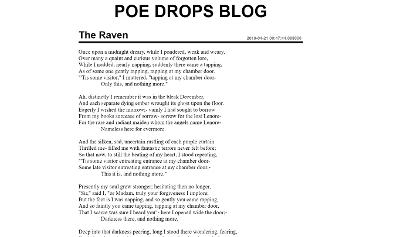

# Alan Poe Blog
> A functional blog built in Jinja2 and google App Engine


For this project, my task was to create a Edgar Allan Poe Poem Blog. This blog is a Python webserver program using the `google.appengine.ext` as database and `Jinja2` framework to render the templates. Besides, I used `webapp2` module to set up the pages of blog.



## Requirements
- Python 2.7
- webapp2
- webob
- Google Cloud SDK
- Jinja2
- google.appengine.ext

## Development setup

1. Donwload and Install Python 2.7 [link](https://www.python.org/downloads/release/python-2716/)

2. Setting Up a Google Cloud SDK Environment [link](https://cloud.google.com/python/setup?hl=en-us)

2. Install all needed Python modules

```sh
pip install webapp2
```

```sh
pip install webob
```

```sh
pip install Jinja2
```

```sh
pip install google.appengine.ext
```

## Running the program

1. in the same folder that **blog.py** file are: `python "C:\Users\YOUR_USER\AppData\Local\Google\Cloud SDK\google-cloud-sdk\bin\dev_appserver.py" .`

2. Replace your PC user in `YOUR_USER`. (_Dont forgot the dot in the final._)

3. In your browser access [http://localhost:8080/](http://localhost:8080/)


## Usage example

In the root page `http://localhost:8080/` you can see all posts.

If you enter in `http://localhost:8080/newpost` you can create newposts to the blog

_If you find bugs or problems you can sent a message to me [twitter] or [email]._


## Release History

* 0.0.2
   * README file updated
* 0.0.1
   * first version

## Meta

Pedro Carvalho – [@PedrArch](https://twitter.com/PedroArch) – pedrofrancocarvalho@gmail.com

[https://github.com/PedroArch](https://github.com/PedroArch/)

## Contributing

1. Fork it (<https://github.com/PedroArch/blog-with-gcloudSDK/fork>)
2. Create your feature branch (`git checkout -b feature/fooBar`)
3. Commit your changes (`git commit -am 'Add some fooBar'`)
4. Push to the branch (`git push origin feature/fooBar`)
5. Create a new Pull Request

<!-- Markdown link & img dfn's -->
[twitter]:https://twitter.com/PedroArch
[github]:https://github.com/PedroArch
[email]: pedrofrancocarvalho@gmail.com
